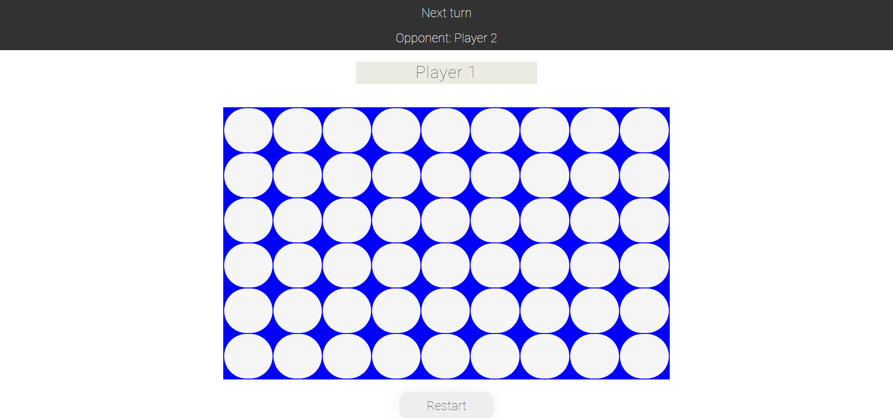

# Genesys-5-in-a-Row Challenge

## About
Connect 4 game was developed using Node.JS,Express.js & SocketIO. Players take turns dropping colored discs from the top into a 
nine-column, six-row vertically suspended grid. The objective of the game is to be the
first to form a horizontal, vertical, or diagonal line of five of one's own discs.
The server.js file holds the lobby or room that the users connect to and basic game logic such as columns,rows,when the game 
ends,turns that each player is allowed to use and event handlers like connection and when the player exits or disconnects.
The client side is the index.html which is found in the folder named "Views".This is where all the client logic is such as drawing 
of the board, inputing the users name, displaying information like when the other player has disconnected,won or tied.
The client and the server communicate using HTTP.

## Libraries and IDE
* Visual Studio Code 1.40.2
* Node.JS
* Express 4.15.2
* Socket.IO 1.7.3

## How to run
> Make sure that you have NodeJS installed [link to url](https://nodejs.org/)

> Open Visual Studio Code

> Run "npm install" in terminal 

> Run "node server.js" in terminal

> Open a browser with two tabs url being http://127.0.0.1:3000/

